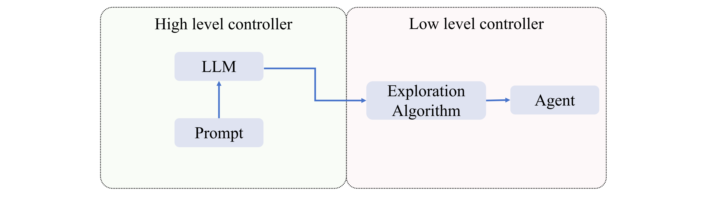
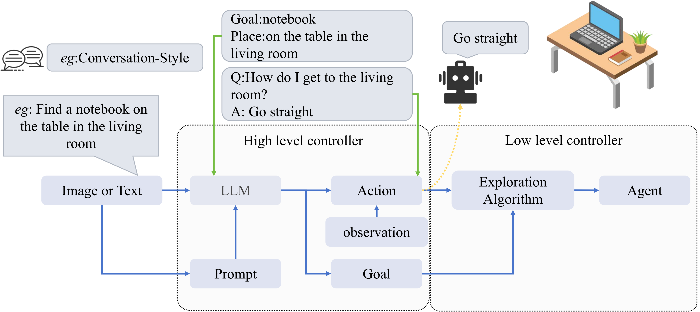
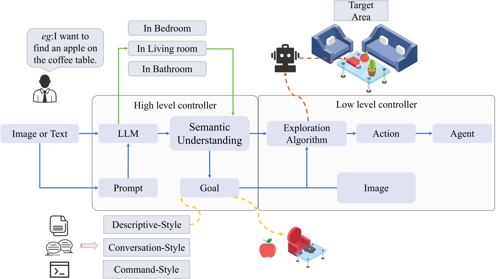

# Awesome-LLM-EN
   

   
 
 
 

This is a compilation on "LLMs for Embodied Navigation," including state-of-the-art benchmarks and datasets.  

 
In recent years, the rapid advancement of Large Language Models (LLMs) like GPT has garnered increasing attention for their potential in various practical applications. The integration of LLMs with Embodied Intelligence has emerged as a new focal area. Embodied Intelligence underscores that intelligent behavior stems not just from computational models but also involves physical interactions between robots or intelligent agents and their environment. The essence of embodied intelligence is that genuine intelligence requires the context of both the body and the surrounding environment, necessitating systems that can perceive through sensors and act via actuators. This integration is especially critical for applications that demand language and image processing capabilities. Overall, the amalgamation of LLMs and embodied intelligence offers immense potential and opens up new avenues for AI application, raising fresh research challenges including model interpretability and real-time performance.

Among the numerous applications of LLMs, navigation tasks stand out as they require deep environmental understanding and quick, accurate decision-making. LLMs can enrich embodied intelligence systems with advanced environmental perception and decision-making support through their robust language and image processing skills. This article focuses on navigation, offering a comprehensive summary of the integration between LLMs and embodied intelligence. It covers state-of-the-art models, research methodologies, and evaluates the pros and cons of current embodied navigation models and datasets. Finally, the article provides insights into the role of LLMs in embodied intelligence based on the latest research, projecting future developments in the field.

  

## News
😊 This project is under development. You can hit the **STAR** and **WATCH** to follow the updates.
* Our Awesome-LLM-EN reasoning paper: [The Development of LLMs forEmbodied Navigation](https://arxiv.org/pdf/2311.00530.pdf) is now public.

## Overview
In this repository, we collect recent advances in unifying LLMs and Agents. We have identified two commonly used general models: 

🤖 1) LLM for Planner  

🤖 2) LLM for Semantic Understanding..

  

  

## Table of Contents
- [Awesome-LLM-EN](#awesome-llm-en)
  - [News](#news)
  - [Overview](#overview)
  - [Table of Contents](#table-of-contents)
  - [Related Surveys](#related-surveys)
 -  [LLMs for Grounded Language Understanding](#llms-for-grounded-language-understanding)
  - [LLMs for Few-Shot Planning](#llms-for-grounded-few-shot-planning)
  - [Applications](#applications)
    - [Navigation](#navigation)
    - [Assistant](#assistant)

## Related Surveys

* A Real 3D Embodied Dataset for Robotic Active Visual Learning (IEEE, 2022) [[paper]](https://ieeexplore.ieee.org/abstract/document/9729641)
* ProcTHOR: Large-Scale Embodied AI Using Procedural Generation (Arxiv, 2022) [[paper]](https://arxiv.org/pdf/2206.06994.pdf)
* SOON: Scenario Oriented Object Navigation with Graph-based Exploration (Arxiv, 2021) [[paper]](https://arxiv.org/pdf/2103.17138.pdf)
* Room-Across-Room: Multilingual Vision-and-Language Navigation with Dense Spatiotemporal Grounding (Arxiv, 2020) [[paper]](https://arxiv.org/pdf/2010.07954.pdf)
* Reverie: Remote embodied visual referring expression in real indoor environments (Arxiv, 2019) [[paper]](https://arxiv.org/pdf/1904.10151.pdf)
* Vision-and-Language Navigation: Interpreting visually-grounded navigation instructions in real environments (CVPR, 2018) [[paper]](https://arxiv.org/pdf/1711.07280.pdf)
* Touchdown: Natural Language Navigation and Spatial Reasoning in Visual Street Environments (CVPR, 2019) [[paper]](https://arxiv.org/pdf/1811.12354.pdf)
* March in Chat: Interactive Prompting for Remote Embodied Referring Expression (ICCV, 2023) [[paper]](https://openaccess.thecvf.com/content/ICCV2023/papers/Qiao_March_in_Chat_Interactive_Prompting_for_Remote_Embodied_Referring_Expression_ICCV_2023_paper.pdf)
* Matterport3D: Learning from RGB-D Data in Indoor Environments (Arxiv, 2019) [[paper]](https://arxiv.org/pdf/1709.06158.pdf)
* Vision-and-dialog navigation (pmlr, 2019) [[paper]](http://proceedings.mlr.press/v100/thomason20a/thomason20a.pdf)
* Alfred: A benchmark for interpreting grounded instructions for everyday tasks (CVPR, 2020) [[paper]](https://openaccess.thecvf.com/content_CVPR_2020/papers/Shridhar_ALFRED_A_Benchmark_for_Interpreting_Grounded_Instructions_for_Everyday_Tasks_CVPR_2020_paper.pdf)
* Ving: Learning open-world navigation with visual goals (IEEE, 2021) [[paper]](https://ieeexplore.ieee.org/abstract/document/9561936)
* BERT: Pre-training of Deep Bidirectional Transformers for Language Understanding (Arxiv, 2018) [[paper]](https://arxiv.org/pdf/1810.04805.pdf)
* Grounded language-image pre-training (CVPR, 2022) [[paper]](https://openaccess.thecvf.com/content/CVPR2022/papers/Li_Grounded_Language-Image_Pre-Training_CVPR_2022_paper.pdf)
* Hinge-Loss Markov Random Fields and Probabilistic Soft Logic (Arxiv, 2017) [[paper]](https://arxiv.org/pdf/1505.04406.pdf)
* Dynamic Planning with a LLM (Arxiv, 2023) [[paper]](https://arxiv.org/pdf/2308.06391.pdf)
* Chain-of-thought prompting elicits reasoning in large language models (NIPS, 2022) [[paper]](https://proceedings.neurips.cc/paper_files/paper/2022/file/9d5609613524ecf4f15af0f7b31abca4-Paper-Conference.pdf)
* From Machine Learning to Robotics: Challenges and Opportunities for Embodied Intelligence (Arxiv, 2021) [[paper]](https://arxiv.org/pdf/2110.15245.pdf)

## LLMs for Grounded Language Understanding

* Esc: Exploration with soft commonsense constraints for zero-shot object navigation (Arxiv, 2023) [[paper]](https://arxiv.org/pdf/2301.13166.pdf)
* SayNav: Grounding Large Language Models for Dynamic Planning to Navigation in New Environments (Arxiv, 2023) [[paper]](https://arxiv.org/pdf/2309.04077.pdf)
* L3MVN: Leveraging Large Language Models for Visual Target Navigation (Arxiv, 2023) [[paper]](https://arxiv.org/pdf/2304.05501.pdf)
* Zson: Zero-shot object-goal navigation using multimodal goal embeddings (NIPS, 2022) [[paper]](https://arxiv.org/pdf/2304.05501.pdf)
* Clip-nav: Using clip for zero-shot vision-and-language navigation (Arxiv, 2022) [[paper]](https://arxiv.org/pdf/2211.16649.pdf)
* Clip on wheels: Zero-shot object navigation as object localization and exploration (Arxiv, 2023) [[paper]](http://arxiv.org/pdf/2203.10421v1)
* Vision-based navigation with language-based assistance via imitation learning with indirect intervention (CVPR, 2019) [[paper]](https://openaccess.thecvf.com/content_CVPR_2019/papers/Nguyen_Vision-Based_Navigation_With_Language-Based_Assistance_via_Imitation_Learning_With_Indirect_CVPR_2019_paper.pdf)
* VoxPoser: Composable 3D Value Maps for Robotic Manipulation with Language Models (Arxiv, 2023) [[paper]](https://arxiv.org/pdf/2307.05973.pdf)
* Visual language maps for robot navigation (IEEE, 2023) [[paper]](https://ieeexplore.ieee.org/abstract/document/10160969)
*Language Models as Zero-Shot Planners:Extracting Actionable Knowledge for Embodied Agents (ICLR, 2022)[[paper]](https://openreview.net/forum?id=6NT1a56mNim)

## LLMs for Few-Shot Planning

* A2Nav: Action-Aware Zero-Shot Robot Navigation by Exploiting Vision-and-Language Ability of Foundation Models (Arxiv, 2023) [[paper]](https://arxiv.org/abs/2308.07997)
* March in Chat: Interactive Prompting for Remote Embodied Referring Expression (ICCV, 2023) [[paper]](https://openaccess.thecvf.com/content/ICCV2023/papers/Qiao_March_in_Chat_Interactive_Prompting_for_Remote_Embodied_Referring_Expression_ICCV_2023_paper.pdf)
* NavGPT: Explicit Reasoning in Vision-and-Language Navigation with Large Language Models (Arxiv, 2023) [[paper]](https://arxiv.org/pdf/2305.16986.pdf)
* VELMA: Verbalization Embodiment of LLM Agents for Vision and Language Navigation in Street View (Arxiv, 2023) [[paper]](https://arxiv.org/pdf/2307.06082.pdf)
* OVRL-V2: A simple state-of-art baseline for ImageNav and ObjectNav (Arxiv, 2023) [[paper]](https://arxiv.org/pdf/2303.07798.pdf)
* Sqa3d: Situated question answering in 3d scenes (Arxiv, 2022) [[paper]](https://arxiv.org/pdf/2210.07474.pdf)
* LLM-Planner: Few-Shot Grounded Planning for Embodied Agents with Large Language Models (ICCV, 2023) [[paper]](https://openaccess.thecvf.com/content/ICCV2023/papers/Song_LLM-Planner_Few-Shot_Grounded_Planning_for_Embodied_Agents_with_Large_Language_ICCV_2023_paper.pdf)
# Star History

